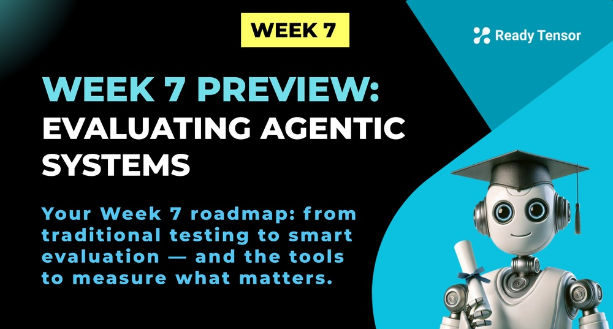

--DIVIDER--

---

[🏠 Home - All Lessons](https://app.readytensor.ai/hubs/ready_tensor_certifications)

[⬅️ Previous - Integrating MCP](https://app.readytensor.ai/publications/35v0wzEbKZBo)
[➡️ Next - Agentic Evaluation Intro](https://app.readytensor.ai/publications/FO7hdfmkhl42)

---

--DIVIDER--

<strong>Welcome to Week 7 of the Agentic AI Developer Certification Program!</strong>

Last week, you learned how to design and build collaborative, multi-agent systems — complete with role assignment, tool-sharing, and even communication via MCP. You began thinking like an agent architect.

Now, it’s time to think like a critic.

**This week is all about evaluation.**
You’ve built intelligent systems. But are they actually… intelligent? Are they safe? Do they behave consistently? Can you trust them in production?

Traditional evaluation methods fall short when dealing with agents that adapt, reason, and act autonomously. You can’t rely on a handful of test cases or accuracy scores — you need an **evaluation strategy that’s as intelligent as the system itself.**

This week, you’ll learn how to evaluate agentic systems in a way that’s rigorous, flexible, and grounded in real-world needs. You’ll build your own evaluation workflows, learn new tools like RAGAS and DeepEval, and apply everything to assess your own agentic authoring assistant.

Let’s make sure our AI isn’t just impressive — but trustworthy.

---

--DIVIDER--

# 🧭 What’s in store this week?

Here’s how the week is structured:

**Lesson 1**: Understand why traditional testing isn’t enough — and what makes evaluation different for agentic AI
**Lesson 2**: Explore seven practical methods for evaluating agentic systems, from LLM judges to human-in-the-loop reviews
**Lesson 3**: Align your metrics with your system’s design using a 7-dimension framework
**Lesson 4**: Use the RAGAS library to evaluate RAG and agentic workflows with real data
**Lesson 5**: Explore DeepEval for testing multi-step and multi-agent LLM chains
**Lesson 6**: Mini Project! Design and run an evaluation for your own agentic authoring assistant
**Submission Guidelines**: Review expectations and deliverables for the Module 2 project

---

--DIVIDER--

# 📏 What will you be able to build?

By the end of this week, you’ll be able to:

- Define evaluation strategies tailored for **open-ended, adaptive agentic systems**
- Choose the right evaluation method for a specific goal (e.g., factuality, coherence, safety)
- Use LLM-as-a-judge, behavior tracing, and human review techniques
- Apply open-source tools like **RAGAS** and **DeepEval** to your projects
- Design your own **evaluation workflows** with minimal code and maximum insight

You’ll also be able to **critically analyze your own systems** — spotting edge cases, failure modes, and improvement opportunities before others do.

This is what sets professional AI developers apart: not just building systems that work, but knowing how and why they work.

Let’s put our systems to the test — and make them stronger.

---

--DIVIDER--

---

[🏠 Home - All Lessons](https://app.readytensor.ai/hubs/ready_tensor_certifications)

[⬅️ Previous - Integrating MCP](https://app.readytensor.ai/publications/35v0wzEbKZBo)
[➡️ Next - Agentic Evaluation Intro](https://app.readytensor.ai/publications/FO7hdfmkhl42)

---
