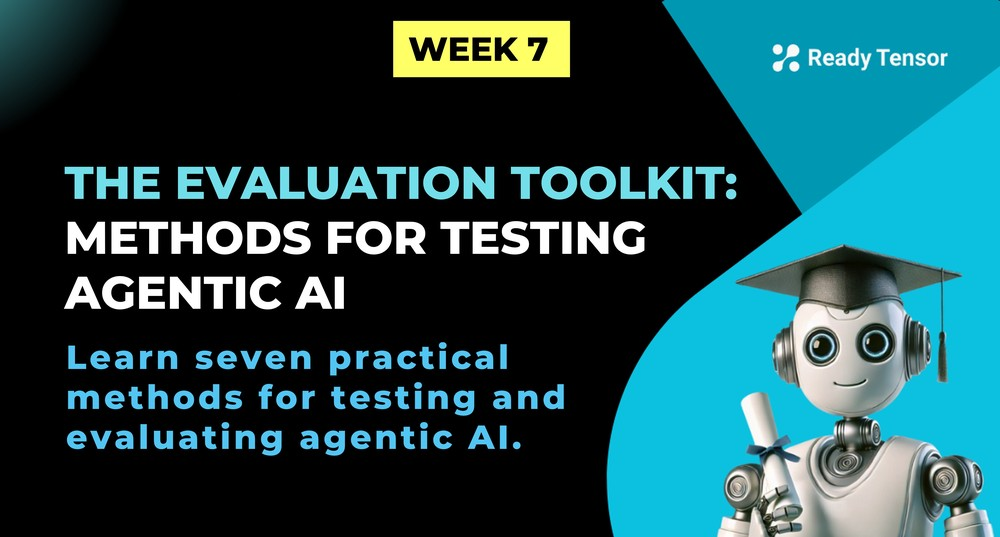
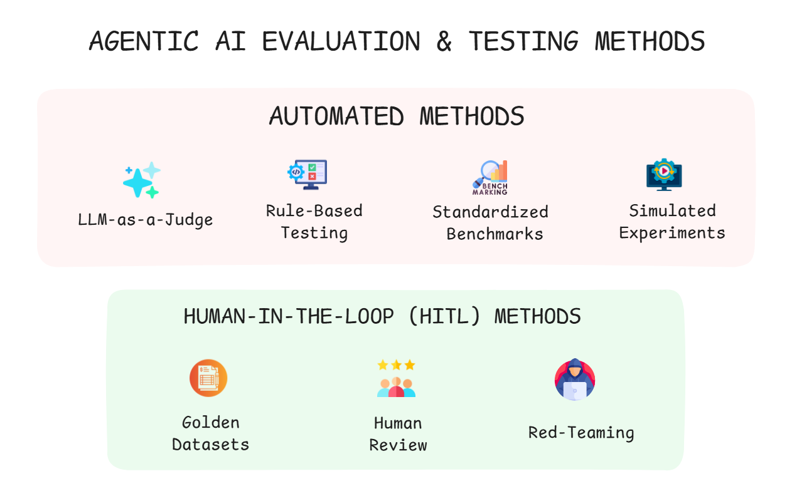
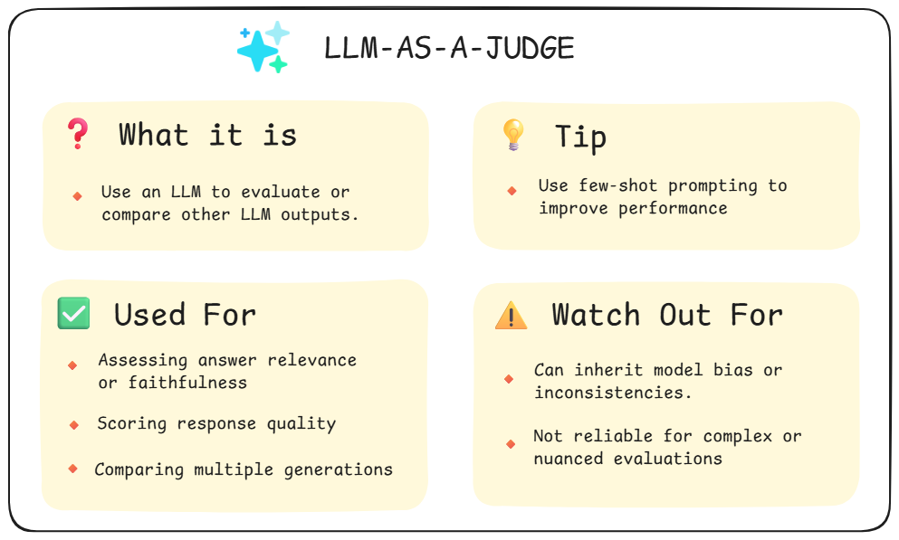
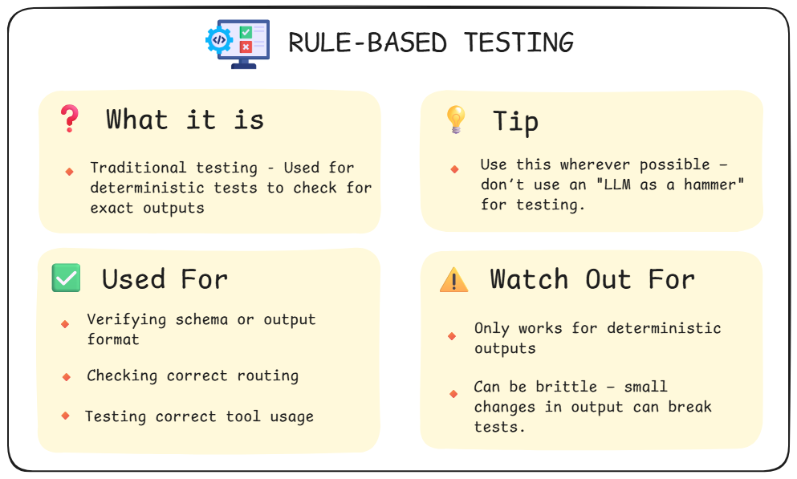
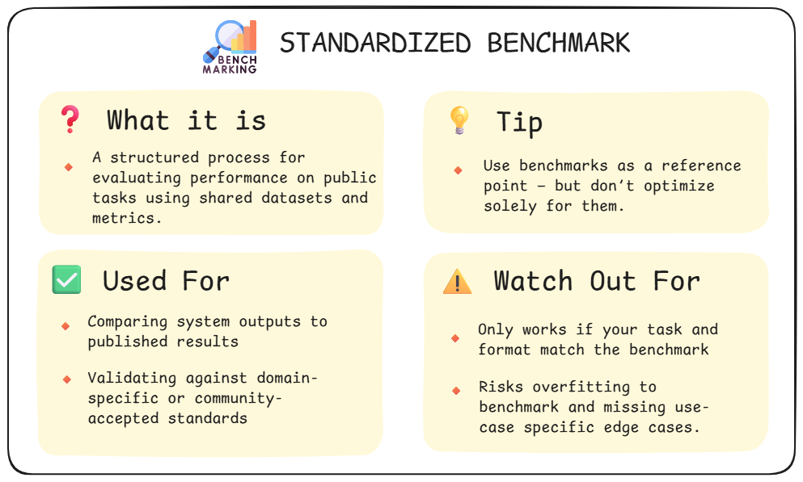
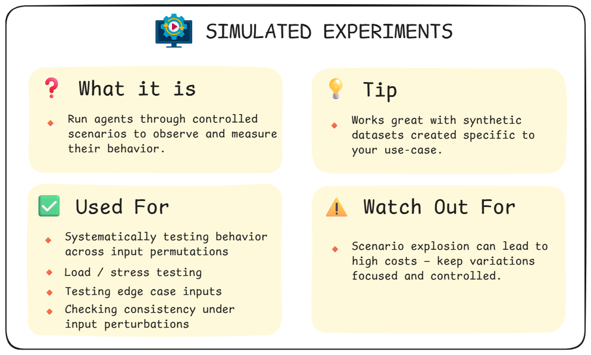
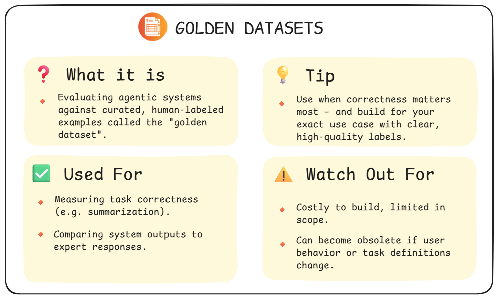
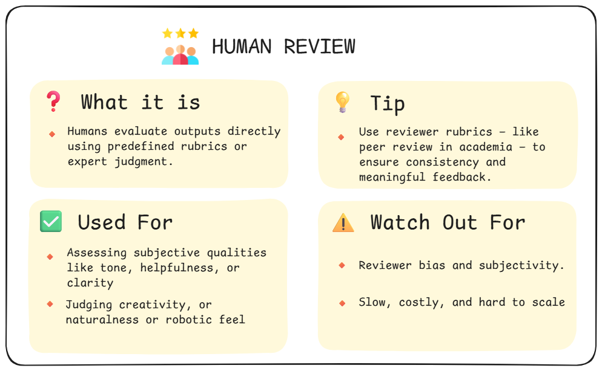
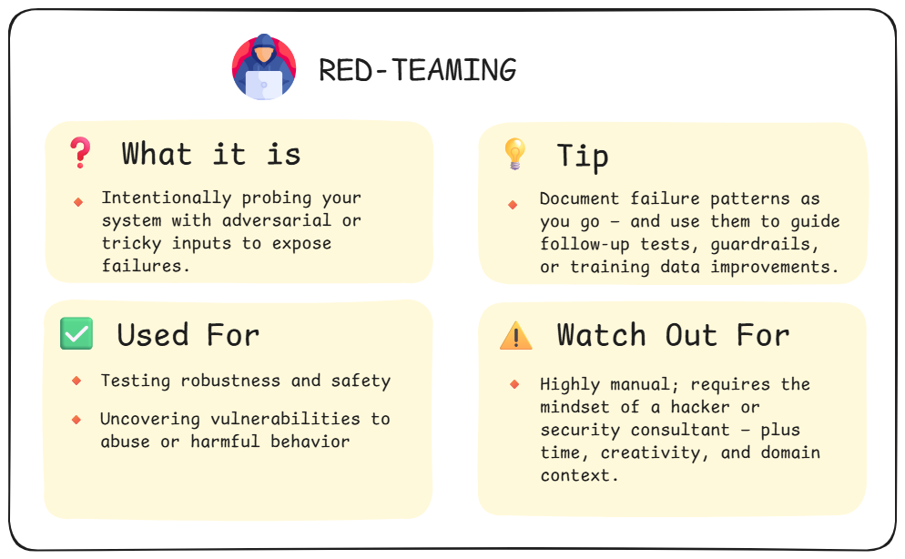
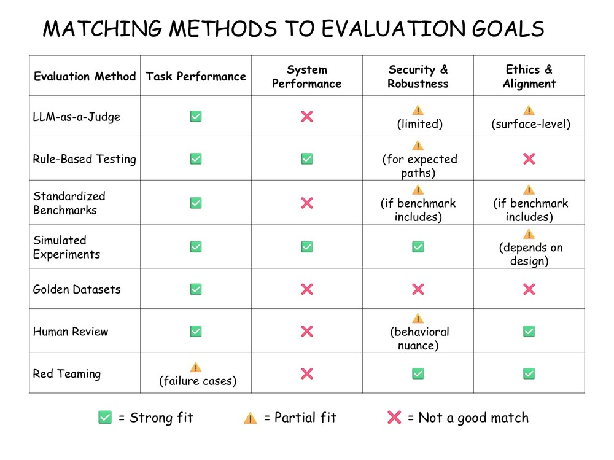

--DIVIDER--

---

# TL;DR

Evaluating agentic AI isn’t one-size-fits-all. In this lesson, you’ll explore seven practical methods for testing systems that think, act, and adapt: from using LLMs as judges to code-based checks, human review, red teaming, and more. Each method has strengths and tradeoffs — and works best when matched to a specific evaluation goal, like task performance, safety, or robustness. By the end, you’ll have a clear mental model of your evaluation toolkit — and know when to reach for which tool.

---

--DIVIDER--

# You’ve Got the What — Now Here’s the How

In the last lesson, we mapped out the big picture: four critical dimensions for evaluating agentic systems — **task performance**, **system performance**, **security & robustness**, and **ethics & alignment**.

Now comes the practical question:

> **How exactly do we run those evaluations?**
>
> What tools do we use?
> Who (or what) decides if the output is “good”?
> How do we catch mistakes — or prevent them in the first place?

That’s where evaluation methods come in.

This lesson is your **toolkit**: seven proven techniques that help you assess whether your AI is behaving intelligently, efficiently, and safely — not just in demos, but in the wild.

We’ll walk through each method, explain where it fits in the overall evaluation landscape, and help you start thinking like a system builder — someone who knows not just how to build agents, but how to hold them accountable.

---

--DIVIDER--

# Your Evaluation Toolkit: Organized for Action

Some evaluation techniques are fast, repeatable, and easy to plug into your dev workflow. Others require human judgment — for scoring, reviewing, or challenging your system in creative ways.

So before we dive in, let’s organize your **evaluation toolkit** around one key question:

> **Can this method be fully automated, or does it require a human in the loop?**

We’ll start with methods that scale easily — ones you can run in CI pipelines or as part of automated test loops. Then we’ll shift to techniques that rely on human insight, care, and sometimes confrontation.

--DIVIDER--

**Here’s the plan:**

---

--DIVIDER--

 <h3>⚡Automated Evaluation Methods </h3>
 
 - **LLM-as-a-Judge**
 - **Rule-Based Testing**
 - **Standardized Benchmarks**
 - **Simulated Experiments**
 
 These methods can be run without direct human involvement once they’re configured — ideal for large-scale evaluation, debugging, and regression testing.
 
 <h3>🧍‍♂️Human-in-the-Loop (HITL) Evaluation Methods </h3>
 
 - **Golden Datasets**
 - **Human Review**
 - **Red Teaming**
 
 These methods rely on human input — to annotate, assess, or adversarially probe agent behavior. They’re essential for catching subtle failures and ensuring systems behave responsibly.
 
 For each method, we’ll cover:
 
 - ✅ What it is
 - 🔍 When to use it
 - ⚖️ What kind of evaluation goal it supports
 - ⚠️ Where it might fall short
 
 Let’s start with the techniques that can be automated.
 
 ---

--DIVIDER--

### 🧠 LLM-as-a-Judge--DIVIDER--

--DIVIDER--

Why ask humans to review every response when you can have an LLM do it?

This method uses an LLM — often a stronger one compared to one you are using in your task — to **score**, **compare**, or **critique** outputs. You can prompt it to evaluate for relevance, correctness, tone, completeness, even step-by-step reasoning quality.

For example, if your agent generates multiple answers to the same question, you can ask an LLM to pick the best one. Or, if you’re debugging hallucinations, you can use it to flag when answers are unsupported by context.

It’s not perfect — and it sometimes mirrors the biases or blind spots of the model itself. But it’s fast, scalable, and surprisingly effective when designed well.

This is the backbone of many modern eval loops, including tools like **RAGAS** and **DeepEval** (which we’ll explore later this week).

---

--DIVIDER--

### 🧪 Rule-Based Testing

--DIVIDER--

--DIVIDER--

Sometimes, you don’t need an opinion — you just need a fact. Did the agent return valid JSON? Did it call the expected tool with the right arguments? Did the chain follow the expected steps?

That’s where **rule-based testing** shines.

Think of this as classic software testing, adapted to agents. You write assertions or validation checks: schemas, regular expressions, type constraints, tool usage logs. If something breaks the rule, it fails the test — no subjectivity involved.

This is especially useful for systems with structured output, deterministic flows, or integration points (e.g. APIs, tool wrappers). It’s also great for testing behaviors like “always include a source” or “never repeat the same step twice.”

Rule-based testing doesn’t tell you whether an answer is good — it tells you whether the system **followed the rules you defined**. And sometimes, that’s exactly what you need.

---

--DIVIDER--

### 📊 Standardized Benchmarks

--DIVIDER--

--DIVIDER--

When your task aligns with a well-known public evaluation benchmark — and if your agent’s output format matches the benchmark structure — **standardized benchmarks** can be your best friend.

These are publicly available datasets and test suites designed to evaluate LLMs and agentic systems on common tasks. They often come with pre-written prompts, expected answers, and scoring logic.

Benchmarks can be task-focused — like **HumanEval** (code generation), **PubMedQA** (biomedical question answering), or **GSM8K** (math). Or they can focus on safety and ethics — like **TruthfulQA**, **RealToxicityPrompts**, or **HolisticEval**.

You won’t use these for every system you build, but when applicable, they give you a reproducible, community-aligned way to measure performance. Just be careful not to over-optimize — benchmarks are helpful, but they’re not the full picture.

---

--DIVIDER--

### 🎭 Simulated Experiments

--DIVIDER--

--DIVIDER--

Agentic systems don’t just generate text — they act. They use tools, make decisions, route tasks, and adapt to changing inputs.

**Simulated experiments** are one of the most useful — and often underrated — ways to evaluate this behavior. You define controlled scenarios, run agents through them systematically, and observe how they respond. It’s ideal for checking consistency, tool use, planning, and even load handling. You can run permutations of input configurations, apply small perturbations, or simulate different user goals — then evaluate how reliably your agent behaves.

It’s also a powerful way to **stress-test** your system under load or unusual task flows. And when paired with **synthetic datasets**, it becomes one of the most targeted tools in your evaluation stack.

Just watch out for **scenario explosion** — it’s easy to overdo it. Keep your test cases focused and purposeful, and this method will give you high-value insights without burning your budget.

---

--DIVIDER--

## 🧍‍♂️ Human-in-the-Loop (HITL) Evaluation Methods

Some aspects of agentic behavior can’t be captured with rules, benchmarks, or LLM judgments. When outputs are nuanced, tasks are subjective, or the stakes are high, you need humans — to review, annotate, challenge, and interpret the system’s behavior.

These methods don’t scale as easily, but they **catch what automation misses**: subtle failures, ethical edge cases, usability issues, and behaviors that defy simple scoring.

They’re slower, yes — but essential when trust, safety, and real-world readiness are on the line.

Let’s walk through three high-impact methods that bring human judgment into the loop.

---

--DIVIDER--

### 🏅 Golden Datasets--DIVIDER--

--DIVIDER--

If your task has a clear right answer, few methods beat the reliability of a well-constructed golden dataset.

These are curated examples with trusted outputs — built by humans — that let you measure correctness directly. They’re especially useful for tasks like summarization, classification, extraction, or question/answering, where accuracy matters and ambiguity is low.

Golden datasets don’t just test _what_ your agent produces — they give you a repeatable benchmark for tracking improvements over time or comparing systems side by side.

But they don’t come for free. Creating a high-quality golden set takes real effort — and it won’t catch unexpected failures or assess subjective qualities like helpfulness or tone.

Still, when your task is well-defined, and correctness is critical, golden datasets are one of your most powerful evaluation tools.

--DIVIDER--

:::info{title="Info"}

 <h2>How Golden Datasets Are Built </h2>
 
 Golden datasets are typically built by humans — but the who and how can vary:
 
 - Subject matter experts (e.g. system developers, researchers) for nuanced or domain-specific tasks
 - Domain professionals for high-accuracy use cases
 - Crowdsourcing platforms (like Mechanical Turk) for large-scale annotation, often with expert-designed review and quality checks
 
 The key is that each example has a trusted, ground-truth output — not just a plausible guess.
 :::
 
---

--DIVIDER--

### 👁️ Human Review

--DIVIDER--

--DIVIDER--

Some things still need a human eye.

When outputs are subjective, high-stakes, or hard to define objectively — **human review** becomes essential. It’s the simplest form of evaluation: real people, reviewing real outputs, and scoring them based on a clear rubric or expert judgment.

Think of it like **peer review at an academic conference** — reviewers use shared criteria to assess quality, innovation, contribution, completeness, and more. In agentic systems, it’s often used to assess tone, helpfulness, reasoning quality, or edge-case behavior.

At Ready Tensor, we’ve used human review to evaluate whether responses feel natural, cite sources correctly, or flag the right issues for escalation. It’s especially valuable as a **final QA step** before shipping.

But it’s also expensive and slow. You can’t scale it easily, and you’ll need to account for **reviewer bias**, **rubric clarity**, and **agreement between raters**.

Still, when you need high-quality evaluation — or when no automated method will do — **nothing beats a person reading the output**.

---

--DIVIDER--

### 🧨 Red Teaming

--DIVIDER--

--DIVIDER--

Sometimes you don’t want to see how your agent behaves when everything goes right — you want to see how it fails.

**Red teaming** is the practice of **intentionally probing your system** with adversarial, tricky, or malicious inputs to uncover weaknesses. It’s not about evaluating average behavior — it’s about stress-testing the edge cases.

That could mean trying prompt injection attacks, testing harmful instructions, or feeding in confusing scenarios. The goal isn’t just to break things — it’s to **learn how your system breaks**, and whether it fails safely.

It’s one of the most powerful ways to uncover blind spots — but also one of the most manual. You’ll need creativity, domain context, and often several rounds of exploration to surface real issues.

Still, if you’re serious about robustness, alignment, and real-world readiness — **you can’t afford to skip it**.

---

--DIVIDER--

# 🗺️ Matching Methods to Evaluation Goals

Each evaluation method supports a different slice of the evaluation landscape — and no single one does it all.

Use this matrix to see which methods align with which goals, so you can choose the right tools for the job:

--DIVIDER--

 
<em>Figure: Mapping Evaluation Methods to Key Evaluation Goals</em>

 
 ---

--DIVIDER--

# Wrapping Up: Choosing the Right Tools

By now, you’ve seen just how many ways there are to evaluate an agent — and why no single method can do it all.

Some techniques scale effortlessly. Others require human judgment. Some tell you whether the task was completed, others expose where your system breaks, and a few help you judge whether it’s acting responsibly.

The key takeaway?

> **Great agentic systems aren’t just functional — they’re efficient, safe, and aligned. That’s why thoughtful evaluation matters.**

Each method you’ve learned about in this lesson plays a role in that bigger picture. And now that you’ve got the full toolkit, it’s time to get practical.

---

--DIVIDER--

# What’s Next: Measuring Task Performance

In the remaining lessons this week, we’ll zoom in on one of the four core evaluation goals: **task performance**.

You’ll explore practical tools like RAGAS and DeepEval, learn how to design useful metrics, and see how to debug agents at the output level — all focused on answering the question:

> **Did the agentic system actually accomplish the task — and do it well?**

Let’s get started.

---
