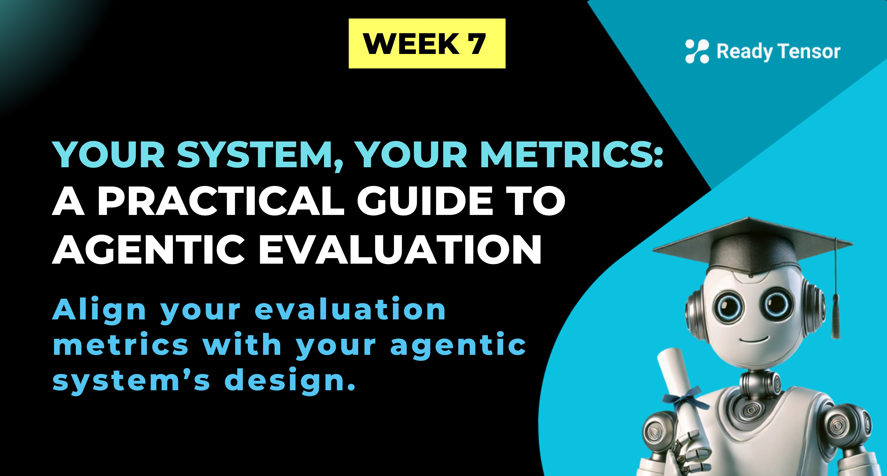
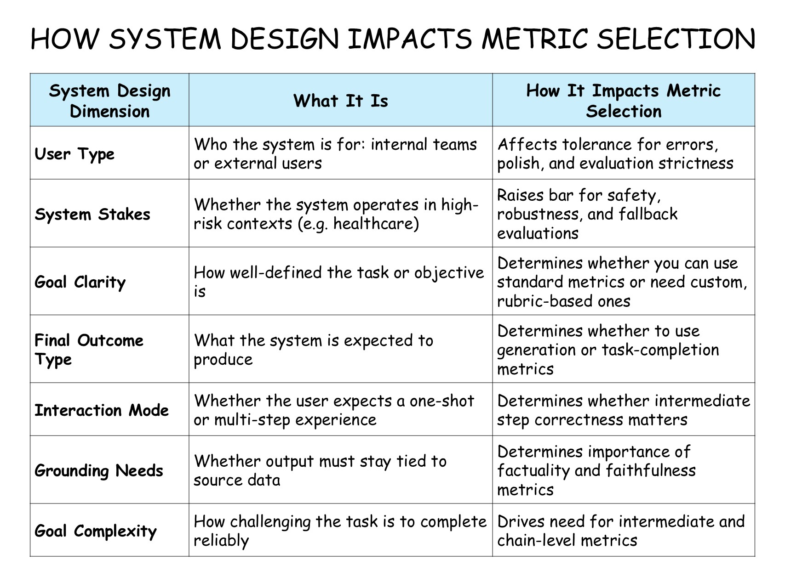
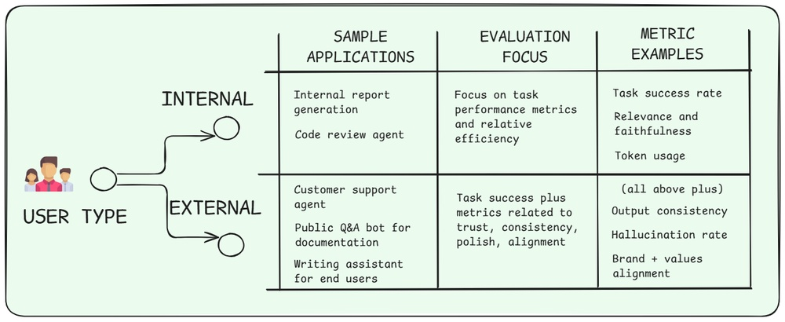
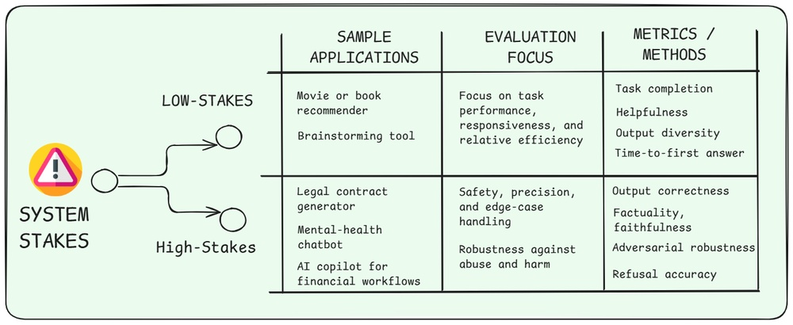
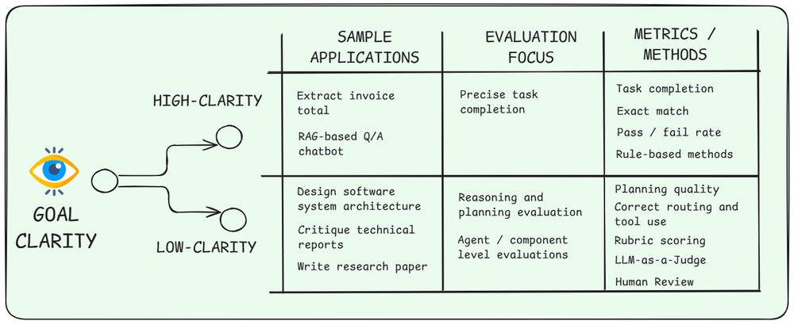
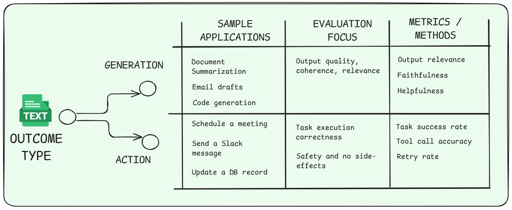
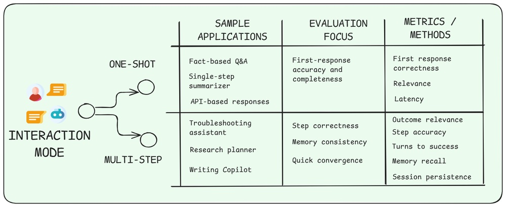
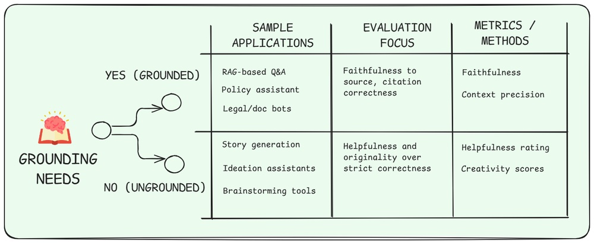
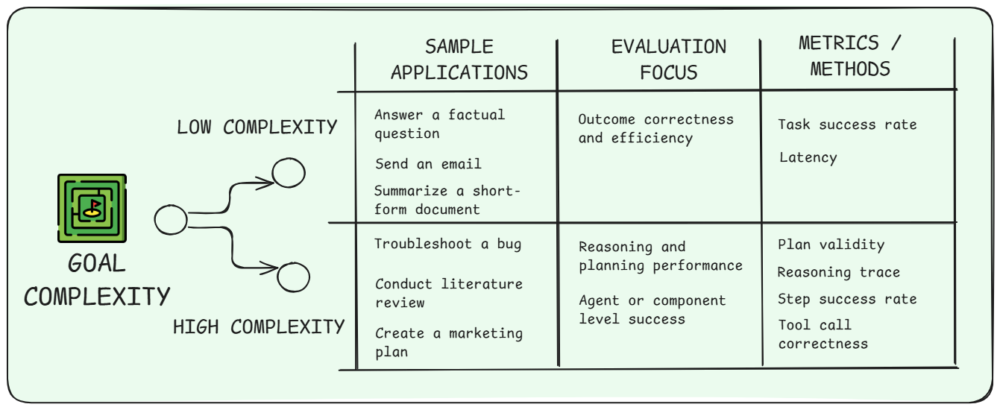

--DIVIDER--

---

[🏠 Home - All Lessons](https://app.readytensor.ai/hubs/ready_tensor_certifications)

[⬅️ Previous - Evaluation Methods](https://app.readytensor.ai/publications/ljPGqR17HJmj)
[➡️ Next - RAGAS Tutorial](https://app.readytensor.ai/publications/Frw6T1fBzVTF)

---

--DIVIDER--

# TL;DR

Agentic systems don’t need more metrics — they need the right ones. In this lesson, you’ll learn how to choose evaluation metrics based on what your system is designed to do, who it’s for, and how it operates. We’ll walk through seven key design dimensions — like output type, interaction mode, and user type — and show how each one guides what to measure. Whether you’re building a single-turn assistant or a multi-agent planner, this lesson helps you focus on what truly matters for your use case.

---

--DIVIDER--

# You Have Your Agentic System Built. What Should You Measure?

By now, you know what makes agentic systems so tricky to evaluate — they don’t just return outputs, they act, adapt, and sometimes surprise you. That was Lesson 1 in this week.

You’ve also seen the many ways we can test and evaluate them — LLM judges, benchmarks, human review, red teaming, and more. That was Lesson 2.

But now comes the hard part:

> **What exactly should you measure — and why?**

Should you optimize for task success? Speed? Robustness under attack? Faithfulness to source material? All of the above?

The answer, like most things in AI engineering, is: **it depends on your use-case.**

In this lesson, you’ll get a clear, practical framework to figure out what to prioritize when evaluating your system. We’ll walk through seven core design dimensions that shape how your agentic system behaves — and show how each one helps narrow down the metrics that matter most for what you’ve actually built.

Whether you’re designing a one-shot summarizer, a multi-step, multi-agent planner, or a human-facing assistant for a real product, this lesson will help you focus on what matters most — and ignore the noise.

Let’s get into it.

---

--DIVIDER--

# The System Design Dimensions That Shape What You Should Measure

Not all agentic systems are built the same — and not all should be evaluated the same way.

To choose the right metrics, you first need to understand what kind of system you’re building. That means asking:

- What does the system produce?
- Who is it for?
- How complex is it under the hood?
- And how do users expect to interact with it?

To make that easier, we’ve distilled these questions into seven key dimensions — a compact framework that helps you identify what matters most in your use case.

Here they are:

--DIVIDER--

--DIVIDER--

Let's now review each dimension and how it guides your metric choices.

---

--DIVIDER--

## 🧑‍💻 User Type

--DIVIDER--

--DIVIDER--

Who your system serves — internal teams or external users — should directly shape how you evaluate it.

Internal tools are often judged by whether they work, not how they feel. That means your evaluation can focus on **task success**, **intermediate step correctness**, and **functional reliability**. Errors are acceptable if they’re easy to debug or recover from.

External systems, on the other hand, are held to a higher bar. Now, **tone**, **consistency**, and **trustworthiness** matter just as much as correctness. Evaluation needs to capture whether users would feel safe, satisfied, and confident using the system — even when things go wrong.

:::info{title="Good Enough — for Whom?"}

> _Suppose your system gives good responses 90% of the time. Good enough to ship to production? It depends on who it’s built for._
> :::

---

--DIVIDER--

## ⚠️ System Stakes

--DIVIDER--

--DIVIDER--

Some systems can afford to get things wrong. Others simply can't.

When your system operates in a **low-stakes** setting — like recommending a movie or brainstorming ideas — a little noise or failure might be acceptable. Users can shrug off minor issues, and evaluation can focus more on usefulness than safety. In fact, a little creativity or unexpected output (hallucination) can even be a bonus.

But in **high-stakes** domains — healthcare, finance, legal, or anything involving sensitive data — the cost of failure is much higher. Evaluation needs to account not just for whether the task was completed, but whether the system remained safe, responsible, and robust under pressure.

:::info{title="High Stakes, High Standards"}

> When mistakes carry real consequences, your metrics need to surface them — not smooth them over.

:::

---

--DIVIDER--

## 🎯 Goal Clarity

--DIVIDER--

--DIVIDER--

Some systems have clearly defined success conditions — like extracting a date, answering a factual question, or hitting an API. For these, evaluation is straightforward: the output is either right or wrong.

But other systems operate in fuzzier territory. Tasks like summarizing research or giving feedback don’t have a single “correct” answer. They require reasoning, interpretation, and subjective judgment.

With **high-clarity tasks**, focusing on the **final output** is usually enough. Accuracy, exact match, and task success give you a clear read on performance.

With **low-clarity tasks**, that might not be enough — because the goal itself is hard to measure. In these cases, it’s better to evaluate the thinking process: planning, reasoning, and decision quality. And to do that well, you’ll need custom rubrics, heuristic scoring, or structured reviews using LLMs or human experts.

:::info{title="Different Risks, Different Challenges"}

> In generation tasks, evaluation is often **subjective** — focused on quality, tone, or clarity — but the output is self-contained. In action tasks, evaluation is more **deterministic**, but the stakes are higher: mistakes can trigger unintended side effects or affect external systems. Each demands a different kind of rigor.

:::

---

--DIVIDER--

## 🧾 Outcome Type

--DIVIDER--

--DIVIDER--

What is your agent ultimately supposed to deliver — a **piece of content**, or a **real-world action**?

That single distinction changes how you evaluate it.

If your system produces **reports, summaries, or drafts**, you’ll care about things like coherence, relevance, fluency, and tone. These are generation-oriented systems, and evaluation often relies on **LLM-as-a-judge**, **human review**, or **rubric scoring**.

But if your system performs **actions** — like scheduling a meeting, sending an email, or triggering an API — then correctness becomes binary. Did the thing get done, and was it done safely?

Evaluation here focuses on **task success**, **tool usage accuracy**, and **side-effect safety**.

:::info{title="Different Risks, Different Challenges"}

> In generation tasks, evaluation is often **subjective** — focused on quality, tone, or clarity — but the output is self-contained. In action tasks, evaluation is more **deterministic**, but the stakes are higher: mistakes can trigger unintended side effects or affect external systems. Each demands a different kind of rigor.

:::

---

--DIVIDER--

## 🔁 Interaction Mode

--DIVIDER--

--DIVIDER--

Does the user expect a quick, one-shot result — or are they prepared for a multi-step journey?

That expectation shapes how you evaluate the system.

One-shot systems are built for immediate answers. Users want fast, accurate results — no back-and-forth. Evaluation here focuses on **first-response accuracy**, **completeness**, and **clarity**. Think Q\&A bots, instant summarizers, or retrieval assistants.

Multi-step systems, on the other hand, are designed for longer tasks — troubleshooting, onboarding, research flows. Users tolerate back-and-forth, but that doesn’t mean they enjoy it.

> The goal is always the same: **get the user to success with as little friction as possible**.

That means your metrics should reward systems that handle **intermediate steps** correctly, **converge quickly**, and maintain consistent behavior across turns. For longer sessions, you may also need to test **memory persistence**, **context recall**, and even **session continuity** across reboots or re-authentication.

:::tip{title="Evaluate the Route"}

> When your system is a multi-turn guide, don’t just measure the destination — measure the route.

:::

---

--DIVIDER--

## 📚 Grounding Needs--DIVIDER--

--DIVIDER--

Does your system need to **stick to a specific source of truth**, or can it respond using pretrained information — or even **improvise**?

That distinction changes what kinds of errors you need to catch.

In systems like RAG assistants, policy bots, or documentation Q\&A, the agent is expected to **stay strictly within the source material**. The key concern is faithfulness: did the output reflect what’s actually in the documents? Did it avoid hallucinating details or fabricating sources?

For systems without grounding — like creative writing, domain experts, or brainstorming tools — it’s acceptable to draw on general knowledge or even generate novel content. In those cases, you focus more on **helpfulness**, **originality**, and **creativity**, rather than alignment with a reference.

:::info{title="Grounding Sets the Bar"}

> The stricter your grounding requirement, the more your metrics need to detect **hallucinations**, not just weak answers.

:::

---

--DIVIDER--

## 🧠 Goal Complexity

--DIVIDER--

--DIVIDER--

Some tasks are simple: answer a question, generate a summary, call an API. Others are inherently complex — like planning a project, booking a travel trip, troubleshooting a problem, or writing a movie script.

As goal complexity increases, so does the need for **multi-step reasoning**, **tool use**, and **intermediate decision-making**. That means you can’t just evaluate the final result — you need to look inside the system at the component-level.

High-complexity goals demand metrics that track how well the system **plans**, **reasons**, **routes**, and **executes each step**. This often includes **intermediate success rates**, **tool call accuracy**, and **chain-of-thought quality** — not just whether the outcome was acceptable.

:::tip{title="Trace the Whole Chain"}

> When the goal is complex, evaluation needs to track the full process — not just the final result.

:::

---

--DIVIDER--

# Case Study: Evaluating the Agentic Authoring Assistant

The Agentic Authoring Assistant (A3) on the Ready Tensor platform helps users auto-generate publication metadata — including the **title**, **tags**, **TL;DR**, and **references**. Each output improves how projects are presented, discovered, and shared.

We will evaluate each of the four outputs from the system, and then also assess the overall coherence of the system’s outputs. This will help us understand how well A3 meets user needs, maintains quality, and delivers a consistent experience.

--DIVIDER--

## 📊 Dimensional Breakdown

To evaluate this system, we apply the 7 design dimensions to each component and derive what matters most — and how to measure it.

| **Component**       | **User Type** | **System Stakes** | **Goal Clarity** | **Outcome Type** | **Interaction Mode** | **Grounding Needs** | **Goal Complexity** |
| ------------------- | ------------- | ----------------- | ---------------- | ---------------- | -------------------- | ------------------- | ------------------- |
| **Title**           | External      | Low               | High             | Generation       | One-shot             | Yes                 | Low                 |
| **Tags**            | External      | Low               | High             | Generation       | One-shot             | Yes                 | Low                 |
| **TL;DR Summary**   | External      | Low               | High             | Generation       | One-shot             | Yes                 | Low                 |
| **References**      | External      | Low               | High             | Generation       | One-shot             | Yes                 | Medium              |
| **Coherence (All)** | External      | Low               | High             | Generation       | One-shot             | Yes                 | Medium              |

--DIVIDER--

|

Let’s break down how each part of the Agentic Authoring Assistant maps to the seven design dimensions — and why.

 <h3>User Type</h3>
 
 All components are designed for **external users**. While the platform hosts their work, A3 is helping them publish and share it with others — so quality and presentation matter.
 
 _Implication: Evaluation must include polish, tone, and presentation quality — not just task correctness._
 
 <h3>System Stakes</h3>
 
 We marked these as **low stakes**, since A3 is an assistant, not a decision-making agent. Users can always ignore suggestions or revise them. That said, if A3 were a paid product or embedded into a professional workflow, stakes might rise to **medium**, especially because users would then be expecting the system to work at a higher level consistently.
 
 _Implication: Evaluation can tolerate minor errors, but should still surface inconsistencies or issues that affect user trust._
 
 <h3>Goal Clarity</h3>
 
 All tasks have a **clear objective** — generate a title, a summary, some tags, etc. There's little ambiguity about what a "complete" result looks like, even if there's room for variation in quality. 
 
 _Implication: Reference-based and automatic metrics (e.g., similarity scores, exact match, relevance ratings) are appropriate and reliable._
 
 <h3>Outcome Type</h3>
 
 Every component produces a **generated output** (text).
 
 _Implication: Use metrics suited to generation — such as fluency, clarity, faithfulness, and relevance — rather than task completion or action success._
 
 <h3>Interaction Mode</h3>
 
 A3 is currently **single-turn** — each feature runs once per user click. There’s no back-and-forth interaction or refinement loop (yet). That keeps the interaction model simple and eval focus on one-shot quality.
 
 _Implication: Prioritize evaluating immediate output quality; no need for session-level or memory persistence checks._
 
 <h3>Grounding Needs</h3>
 
 All outputs must be **grounded in the user’s publication**. Whether it’s the title, tags, or summary, hallucinations or off-topic suggestions are a problem. Even the image should loosely reflect the content or theme.
 
 _Implication: Faithfulness scoring is essential — using LLM judgment, textual similarity, or rule-based grounding checks._
 
 <h3>Goal Complexity</h3>
 
 Most components are **low complexity**, requiring basic generation from provided content. But **references** are a bit trickier — they involve external search, filtering, and justification. And judging whether **all outputs work well together** (coherence) is a more subjective, **medium-complexity** task.
 
 _Implication: Use simple outcome metrics for low-complexity tasks, and structured rubrics with LLM-as-a-Judge for more subjective components like references and coherence._
 
---

--DIVIDER--

## 🛠️ How We Evaluate the Agentic Authoring Assistant

Each part of the A3 system is evaluated based on **final outputs**, not internal reasoning or multi-step coordination. That’s because the tasks are **simple, well-scoped, and one-shot** — even though our underlying architecture uses a supervisor pattern, it doesn't require complex routing or intermediate validation.

Instead, we use a mix of **LLM-as-a-Judge**, **golden datasets**, and **rule-based methods** to assess how useful, faithful, and aligned each output is.

For our golden dataset, we sampled high-quality publications from the Ready Tensor platform — ones that already had strong titles, summaries, tags, and references. These were curated and reviewed by experts to ensure quality and consistency. Because of this, creating a gold standard wasn’t cumbersome: the “ground truth” already existed in the best examples.

The table below summarizes our approach for each component:

--DIVIDER--

| **Component**       | **Focus Area**                    | **Evaluation Methods**         | **Metrics**                                            |
| ------------------- | --------------------------------- | ------------------------------ | ------------------------------------------------------ |
| **Title**           | Relevance, clarity, engagement    | LLM-as-a-Judge, Golden dataset | Relevance rating, Similarity score, Faithfulness score |
| **Tags**            | Accuracy, topical coverage        | LLM-as-a-Judge, Golden dataset | Relevance rating, Jaccard similarity                   |
| **TL;DR Summary**   | Faithfulness, clarity, brevity    | LLM-as-a-Judge, Golden dataset | Relevance rating, Similarity score, Faithfulness score |
| **References**      | Validity, relevance to content    | Golden dataset, Rule-Based     | Jaccard similarity, Citation validity                  |
| **Coherence (All)** | Consistency across all components | LLM-as-a-Judge                 | Coherence rating                                       |

--DIVIDER--

Because all components are **single-turn generations**, we don’t need metrics for tool routing, agent collaboration, or memory consistency. In more complex systems, you'd see evaluations at the **step level** or across **decision chains**. But here, **output quality is the evaluation focus** — and the methods are chosen to make that judgment reliable and scalable.

---

--DIVIDER--

:::info{title="Evaluation Implementation for A3"}

> Later this week, we’ll walk through our actual implementation of this evaluation workflow — showing how we built it using tools like **RAGAS**, **DeepEval**, and custom scoring functions.

:::

---

--DIVIDER--

## 🧠 Takeaway

Even a relatively simple assistant like A3 spans the full range of evaluation concerns — from task performance (tags, references) to presentation quality (title, TL;DR, image) to overall coherence.

Using the 7-dimension framework helped us pinpoint what to test, why it matters, and how to do it — without treating every part the same. That’s the power of aligning your metrics to your system’s actual design.

---

--DIVIDER--

:::tip{title="Quick Framework Application"}

Before you choose your evaluation methods and metrics for your agentic system, walk through these four steps:

1.  Map your system across the 7 dimensions
2.  Identify which evaluation focus areas matter most for your use case
3.  Select metrics that align with those priorities
4.  Focus evaluation efforts accordingly — don’t measure everything, just what matters

:::

---

--DIVIDER--

# Conclusion

Choosing the right metrics for agentic systems isn’t about checking boxes — it’s about aligning your evaluation with what your system is actually trying to do. By breaking down your system across seven key dimensions, you can move past generic metrics and focus on what truly matters for your users, your goals, and your architecture.

Not every system needs every metric. But every good system needs a clear rationale for how it’s evaluated.

Up next, we’ll explore how to **build evaluation into your development loop** — so metrics don’t just live in a spreadsheet, but help you improve your system week over week.

---

--DIVIDER--

---

[🏠 Home - All Lessons](https://app.readytensor.ai/hubs/ready_tensor_certifications)

[⬅️ Previous - Evaluation Methods](https://app.readytensor.ai/publications/ljPGqR17HJmj)
[➡️ Next - RAGAS Tutorial](https://app.readytensor.ai/publications/Frw6T1fBzVTF)

---
