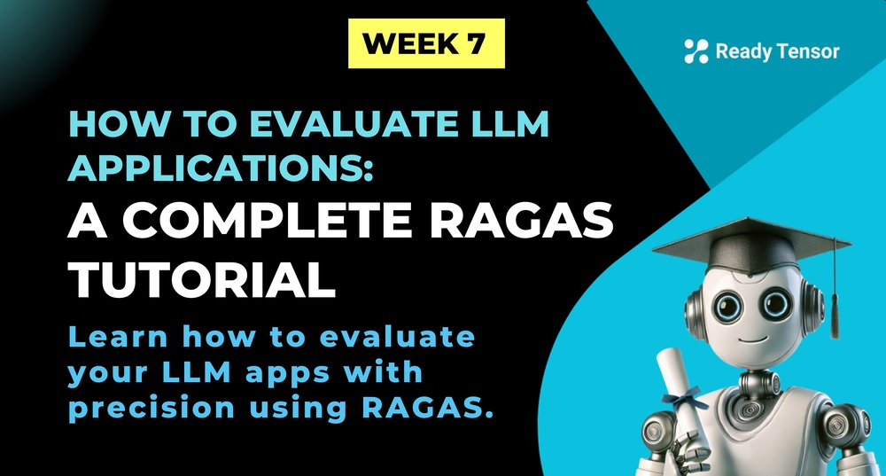
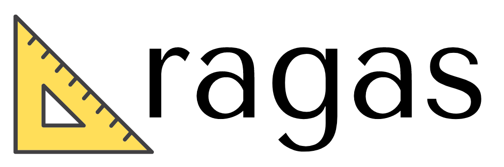

--DIVIDER--

---

[🏠 Home - All Lessons](https://app.readytensor.ai/hubs/ready_tensor_certifications)

[⬅️ Previous - Choosing Eval Metrics](https://app.readytensor.ai/publications/68dY0FXJ1gI1)

---

--DIVIDER--

# TL;DR

In this lesson, you’ll learn how to use RAGAS to evaluate LLM applications with objective, automated metrics. We’ll walk through test set generation, evaluation pipelines, and even creating your own custom metrics—all tailored for agentic, retrieval-augmented, and tool-using AI systems.

---

--DIVIDER--

# From Evaluation Goals to Working Pipelines

This week, we’ve covered what makes agentic AI systems hard to evaluate, explored the evaluation methods available, and learned how to choose the right metrics based on your system’s design.

Now it’s time to put all of that into practice.

> **How do you actually run these evaluations?** > **How do you generate test data, track performance, and get meaningful scores — without reinventing the wheel?**

In this lesson, we’ll show you how to do exactly that using **RAGAS** — a powerful open-source library for evaluating LLM-powered applications. You’ll learn how to generate test sets, run built-in metrics like faithfulness and context recall, and even define your own custom metrics to match your system’s unique goals.

Let’s get started.

---

--DIVIDER--



--DIVIDER--

# What Is RAGAS?

[RAGAS](https://github.com/explodinggradients/ragas) is an open-source evaluation library designed to help you assess the quality of LLM applications — especially those powered by retrieval, reasoning, or multi-step workflows.

It provides a complete toolkit for answering questions like:

- Did the system stick to the source material?
- Was the response accurate and complete?
- Was the retrieved context useful or noisy?
- Can we trust this output — and how do we know?

To answer these, RAGAS combines:

- ✅ **Objective metrics** like faithfulness, context recall, and answer correctness
- 🧪 **Synthetic test set generation** — no labeled data required
- ⚙️ **Custom metric support**, so you can measure what your use case actually needs
- 🔄 **Seamless integration** with frameworks like LangChain and Hugging Face datasets

In short, RAGAS helps turn your evaluation goals into **reproducible, automated workflows** — whether you're building a simple Q&A assistant or a multi-agent system grounded in real-world documents.

Next, we’ll set it up and walk through how to use it step by step.

---

--DIVIDER--

# RAGAS in Action

--DIVIDER--

## Getting Set Up

First, let’s get RAGAS up and running.

RAGAS works best when paired with libraries like LangChain, OpenAI, and Hugging Face datasets — so we’ll install compatible versions of all the essentials to avoid conflicts.

 <h3>📦 Recommended Installation </h3>
 
 ```bash
 pip install "bs4>=0.0.2" \
             "datasets>=3.6.0" \
             "langchain>=0.3.26" \
             "langchain-community>=0.3.26" \
             "langchain-openai>=0.3.25" \
             "ragas>=0.2.15" \
             "rapidfuzz>=3.13.0"
 ```
 
 > This setup uses `gpt-4o` via `langchain-openai` for generation and evaluation, but you can easily swap in other models later.
 
 Once installed, you're ready to generate your first evaluation dataset — no labeled data required.
 
 ---

--DIVIDER--

## Generating a Test Set

One of RAGAS’s most useful features is its ability to generate a **test dataset from your own documents** — no manual labeling required.

This makes it perfect for agentic and RAG-style systems, where you often want to simulate realistic user questions and evaluate how well your system answers them based on provided context.

Let’s walk through the process.

---

--DIVIDER--

 <h3> Step 1: Load Your Documents </h3>
 
 We’ll start by loading documents using LangChain’s `DirectoryLoader`. In this example, we’ll use a local folder of `.md` files — but you can use any supported loader (PDFs, websites, etc.).
 
 ```python
 from langchain_community.document_loaders import DirectoryLoader
 
 path = "path/to/your/docs"
 loader = DirectoryLoader(path, glob="**/*.md")
 docs = loader.load()
 ```

--DIVIDER--

 <h3> Step 2: Choose Your LLM and Embedding Models </h3>
 
 RAGAS requires two models to generate a test set:
 
 - An LLM to generate user questions and answers
 - An embedding model to compare semantic similarity
 
 Here’s how to wrap OpenAI models for use with RAGAS:
 
 ```python
 from ragas.llms import LangchainLLMWrapper
 from ragas.embeddings import LangchainEmbeddingsWrapper
 from langchain_openai import ChatOpenAI, OpenAIEmbeddings
 
 generator_llm = LangchainLLMWrapper(ChatOpenAI(model="gpt-4o"))
 generator_embeddings = LangchainEmbeddingsWrapper(OpenAIEmbeddings())
 ```


--DIVIDER--

 <h3> Step 3: Generate the Test Set </h3>
 
 Now we can generate the test set using the loaded documents and models:
 
 ```python
 from ragas.testset import TestsetGenerator
 
 generator = TestsetGenerator(llm=generator_llm, embedding_model=generator_embeddings)
 dataset = generator.generate_with_langchain_docs(docs, testset_size=10)
 ```
 
 > This will generate 10 synthetic Q\&A examples based on your documents — each with a user question, a reference answer, and the supporting context.

--DIVIDER--

 <h3> Step 4: Preview the Dataset </h3>
 
 To inspect the generated dataset:
 
 ```python
 dataset.to_pandas().head()
 ```
 
 Each row includes:
 
 | Column               | Description                               |
 | -------------------- | ----------------------------------------- |
 | `user_input`         | The generated question                    |
 | `reference`          | The reference answer                      |
 | `reference_contexts` | The relevant context chunks from the docs |
 | `synthesizer_name`   | Which LLM created the synthetic data      |
 


--DIVIDER--

Once you’ve reviewed the test set, you’re ready to run your RAG system on these questions and capture its answers for evaluation.

---

--DIVIDER--

## Preparing for Evaluation

Once you’ve generated your seed test set, the next step is to **run your system** on the generated questions and **record its outputs**. RAGAS will then compare your system’s responses to the ground truth using a set of built-in metrics.

But first — your data needs to be in the right format.

--DIVIDER--

 <h3> 📋 Required Format </h3>
 
 RAGAS expects a structured dataset with the following columns:
 
 | Column               | Description                                                     |
 | -------------------- | --------------------------------------------------------------- |
 | `question`           | The input question (from the test set)                          |
 | `ground_truth`       | The correct answer generated during test set creation           |
 | `answer`             | Your system’s response to the question                          |
 | `contexts`           | The chunks your system retrieved or used to generate the answer |
 | `reference_contexts` | The original context chunks from the test set                   |
 | `synthesizer_name`   | (Optional) The name of the LLM used to generate the test sample |
 
 > The most common mistake at this step? Forgetting to populate `answer` and `contexts`. These are **your system’s outputs** — and the heart of the evaluation.

--DIVIDER--

 <h3> Example Row </h3>
 
 | question                      | ground_truth                                                                        | answer                                                    | contexts           | reference_contexts | synthesizer_name |
 | ----------------------------- | ----------------------------------------------------------------------------------- | --------------------------------------------------------- | ------------------ | ------------------ | ---------------- |
 | “What is LangChain used for?” | “LangChain helps developers build LLM applications with tools, memory, and chains.” | “LangChain is a framework for building LLM-powered apps.” | \[context A, B, C] | \[context A, B]    | gpt-4o           |

--DIVIDER--

 <h3> 🧠 Tip: Use Pandas for Assembly  </h3>
 
 If you’ve collected your system’s outputs in a notebook or script, Pandas is a convenient way to structure and verify your data:
 
 ```python
 import pandas as pd
 
 df = pd.DataFrame({
     "question": questions,
     "ground_truth": references,
     "answer": system_answers,
     "contexts": retrieved_contexts,
     "reference_contexts": reference_contexts,
     "synthesizer_name": ["gpt-4o"] * len(questions)
 })
 ```
 
 Then you can convert it into a Hugging Face `Dataset` for evaluation:
 
 ```python
 from datasets import Dataset
 evaluation_dataset = Dataset.from_pandas(df)
 ```
 
 Once this is ready, you’re all set to run the evaluation.
 
 ---

--DIVIDER--

## Running the Evaluation

Once your dataset is properly structured and loaded, scoring it with RAGAS is straightforward.

You’ll specify which metrics to use, run the evaluation, and get back a score for each sample — across multiple dimensions like faithfulness, answer correctness, and context quality.

--DIVIDER--

 <h3> Step 1: Choose Your Evaluation Metrics </h3>
 
 RAGAS includes several built-in metrics. Here’s a quick preview of some commonly used ones:
 
 | **Metric**            | **What It Measures**                                      |
 | --------------------- | --------------------------------------------------------- |
 | `faithfulness`        | Does the answer align with the retrieved context?         |
 | `answer_correctness`  | Is the answer correct relative to the reference?          |
 | `context_recall`      | Did your system retrieve all relevant context chunks?     |
 | `context_precision`   | Were the retrieved chunks actually relevant?              |
 | `answer_relevancy`    | Is the answer relevant to the user’s question?            |
 | `semantic_similarity` | How semantically close is the answer to the ground truth? |
 
 You can use any subset of these depending on your system goals (as discussed in Lesson 3).

--DIVIDER--

 <h3> Step 2: Run the Evaluation </h3>
 
 Here’s how to run the evaluation using `gpt-4o` for LLM-based metrics:
 
 ```python
 from ragas import evaluate
 from ragas.llms import LangchainLLMWrapper
 from langchain_openai import ChatOpenAI
 
 evaluator_llm = LangchainLLMWrapper(ChatOpenAI(model="gpt-4o"))
 
 result = evaluate(
     dataset=evaluation_dataset,
     metrics=[
         faithfulness,
         answer_correctness,
         context_precision,
         context_recall,
         answer_relevancy,
         semantic_similarity
     ],
     llm=evaluator_llm
 )
```

--DIVIDER--

 <h3> Step 3: View the Results </h3>
 
 You’ll get a new dataset with scores for each metric — one row per question. To preview the results:
 
 ```python
 result.to_pandas().head()
 ```
 
 Sample output:
 
 | question           | answer | faithfulness | answer_correctness | context_recall | ... |
 | ------------------ | ------ | ------------ | ------------------ | -------------- | --- |
 | "What is X?"       | "..."  | 0.92         | 0.88               | 0.76           | ... |
 | "How does Y work?" | "..."  | 0.84         | 0.81               | 0.66           | ... |
 
 You can now track these scores over time, compare across versions, or visualize them to guide improvement.
 
 
 ---

--DIVIDER--

## Creating Custom Metrics

Built-in metrics cover a lot — but not everything.

Sometimes you’ll want to measure something specific to your system or domain. Maybe it’s how concise the answer is. Maybe it’s tone consistency, safety language, or even adherence to a custom rubric.

That’s where **custom metrics** come in.

RAGAS makes it easy to define your own evaluation logic — using the same LLM-based scoring mechanism behind its built-in tools.

--DIVIDER--

---

 <h3> 🧪 Example: Response Conciseness Metric </h3>
 
 Let’s say you want to score how **concise** your system’s answers are. You can create a custom metric that:
 
 - Defines a prompt for the evaluator LLM
 - Accepts each sample’s question, answer, and reference
 - Returns a score from 0 to 1 based on how tight and efficient the response is
 
 ---

--DIVIDER--

 <h3> Step 1: Define the Scoring Prompt </h3>
 
 This prompt instructs the evaluator LLM how to grade the response:
 
 ```python
 instruction = """
 You are an expert evaluator tasked with measuring how concise and efficient a response is.
 
 Evaluate the conciseness of the given response compared to the reference answer.
 
 Consider:
 - Information Density
 - Redundancy
 - Directness
 - Completeness vs Brevity
 - Clarity
 
 Rate from 0 to 1:
 - 1.0: Perfectly concise
 - 0.8–0.9: Very concise
 - 0.6–0.7: Moderately concise
 - 0.4–0.5: Poor
 - 0.0–0.3: Very poor
 """
```

--DIVIDER--

 <h3> Step 2: Implement the Metric Class </h3>
 
 Using the `SingleTurnMetric` interface, define how your prompt gets applied:
 
 ```python
 from ragas.metrics import SingleTurnMetric
 from ragas.types import SingleTurnSample, Score
 from pydantic import BaseModel
 from typing import Optional
 
 class ConcisenessInput(BaseModel):
     user_input: str
     response: str
     reference: Optional[str]
 
 class ResponseConcisenessMetric(SingleTurnMetric):
     def __init__(self, llm):
         self.llm = llm
         # Initialize your scoring prompt here
 
     async def _single_turn_ascore(self, sample: SingleTurnSample, callbacks) -> Score:
         prompt_input = ConcisenessInput(
             user_input=sample.user_input,
             response=sample.response,
             reference=sample.reference or "Not provided"
         )
         try:
             result = await self.conciseness_prompt.generate(
                 data=prompt_input,
                 llm=self.llm,
                 callbacks=callbacks
             )
             return result.score
         except Exception:
             return 0.5  # fallback score
```

--DIVIDER--

 <h3> Step 3: Use It in Your Evaluation </h3>
 
 Once defined, you can drop your custom metric right into the pipeline:
 
 ```python
 from ragas.llms import LangchainLLMWrapper
 from langchain_openai import ChatOpenAI
 
 evaluator_llm = LangchainLLMWrapper(ChatOpenAI(model="gpt-3.5-turbo"))
 response_conciseness = ResponseConcisenessMetric(llm=evaluator_llm)
 
 from ragas import evaluate
 bulk_score = evaluate(
     dataset=evaluation_dataset,
     metrics=[response_conciseness]
 )
 ```
 
 > Just like that, your custom dimension is part of the evaluation loop — using the same structure and data as all the built-ins.
 
 
---

--DIVIDER--

# Conclusion

Evaluating LLM-powered systems — especially agentic ones — isn’t just about accuracy. It’s about faithfulness, context quality, clarity, and many other dimensions that change based on your use case.

**RAGAS gives you a practical, modular way to measure those things**, whether you’re evaluating a RAG assistant, a multi-agent planner, or a single-turn content generator.

With RAGAS, you can:

- ✅ Generate production-aligned test sets
- 🧪 Apply built-in metrics like faithfulness, answer correctness, and context recall
- 🛠️ Define your own custom metrics to evaluate what actually matters for your users

You now have everything you need to turn vague evaluation goals into repeatable, data-driven workflows — and integrate them directly into your development process.

---

--DIVIDER--

# What's Next

Next up, we’ll explore **DeepEval**, a more flexible and developer-friendly framework for building custom evals and assertion-based tests — especially useful for more complex or tool-using agentic systems.

Let’s keep going.

---

--DIVIDER--

# References

For more information, deep dives, and the latest updates on RAGAS, explore the official resources:

- 🌐 **RAGAS Website**: [https://www.ragas.io/](https://www.ragas.io/)
- 📚 **Documentation (Metrics Overview)**: [Available Metrics](https://docs.ragas.io/en/stable/concepts/metrics/available_metrics/)
- 🚀 **Getting Started Guide**: [Run Your First Eval](https://docs.ragas.io/en/stable/getstarted/evals/)
- 🧪 **Natural Language Comparison Metrics**: [Metric Details](https://docs.ragas.io/en/stable/concepts/metrics/available_metrics/#natural-language-comparison)
- 🛠 **GitHub Repository**: [explodinggradients/ragas](https://github.com/explodinggradients/ragas)

---

--DIVIDER--

---

[🏠 Home - All Lessons](https://app.readytensor.ai/hubs/ready_tensor_certifications)

[⬅️ Previous - Choosing Eval Metrics](https://app.readytensor.ai/publications/68dY0FXJ1gI1)

---
