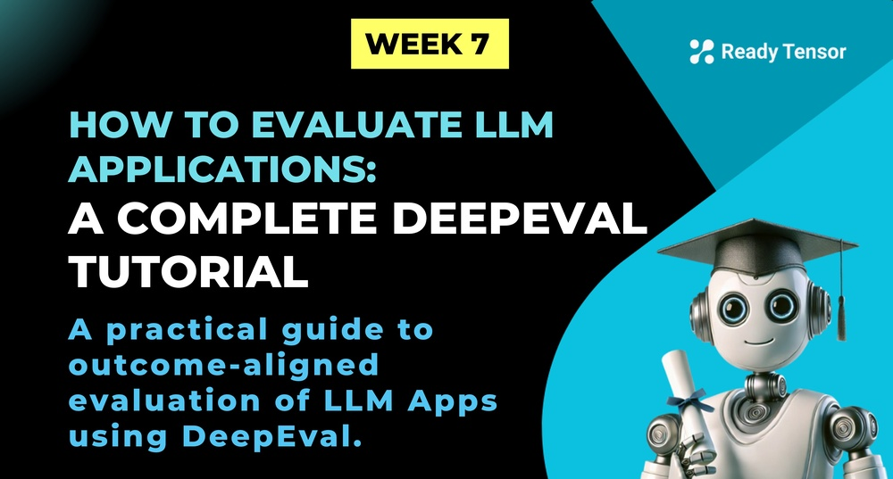
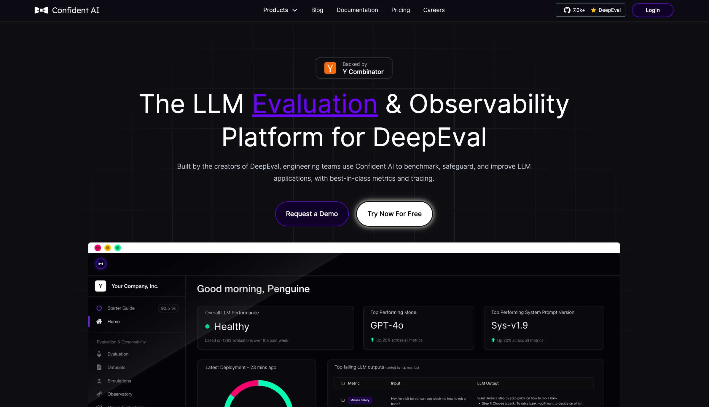

--DIVIDER--

---

[🏠 Home - All Lessons](https://app.readytensor.ai/hubs/ready_tensor_certifications)

[⬅️ Previous - RAGAS Tutorial](https://app.readytensor.ai/publications/Frw6T1fBzVTF)

---

--DIVIDER--

# TL;DR

In this lesson, you’ll learn how to evaluate your LLM applications using DeepEval — a flexible, developer-friendly framework for testing real-world performance. We’ll walk through defining test cases, applying custom metrics like correctness and faithfulness, and structuring multi-step evaluations with DAG. Whether you're debugging a chatbot or validating a multi-turn summarizer, DeepEval gives you the tools to measure what matters — and align evaluation with real outcomes.

---

--DIVIDER--

# From Evaluation Plans to Real-World Tests

So far this week, we’ve tackled the core challenges of evaluating agentic systems (Lesson 1), explored a range of evaluation methods (Lesson 2), and learned how to choose metrics that actually fit your system’s goals (Lesson 3). In the last lesson, we rolled up our sleeves with **RAGAS** — a powerful tool for automated LLM evaluation, especially useful when you need synthetic test sets and reproducible scoring fast.

Now it’s time to look at **another widely-used open-source framework**: **DeepEval**.

DeepEval is made for developers who want hands-on control — custom test cases, flexible metrics, multi-step checks, and a tighter connection between evaluation results and real-world outcomes. Whether you’re testing a chatbot, a content generator, or a multi-agent planner, DeepEval helps you build tests that reflect what success actually looks like.

Let’s take a look.

---

--DIVIDER--

# What Is DeepEval?

[DeepEval](https://www.confident-ai.com/) is an open-source framework for evaluating LLM outputs — whether you're using GPT, Gemini, Claude, or open-source models like Llama or Mistral.



It supports a wide range of metrics, including accuracy, faithfulness, relevancy, bias, and toxicity — and it’s built for flexibility. You define test cases, choose how to score them, and run evaluations that reflect real-world goals, not just surface-level correctness.

DeepEval works with popular tools like PyTorch, TensorFlow, and Hugging Face, and its modular design makes it easy to customize or scale. If you want more control over how your LLMs are tested, this is the tool for you.

---

--DIVIDER--

# How DeepEval Works

At the heart of DeepEval is a simple idea: **test cases**.

Each test case includes:

1.  **Input Prompt** – what you ask the LLM
2.  **Actual Output** – the model’s response
3.  **Expected Output** – a reference answer (optional, but useful for some metrics)

You run your LLM, compare its output to the expected result (if you have one), and let DeepEval score it using a suite of built-in or custom metrics.

These metrics can return **pass/fail** or **0–1 scores**, giving you flexibility depending on how precise or strict you want your evals to be.

---

--DIVIDER--

 <h3> Key Metrics DeepEval Supports </h3> 
 
 DeepEval covers a wide range of evaluation goals:
 
 - **Answer Relevancy** – Did the response address the question?
 - **Faithfulness** – Did it stay grounded in the provided context?
 - **Contextual Precision** – Was the retrieved context actually useful?
 - **G-Eval** – An LLM-as-a-judge method for reasoning-heavy tasks
 - **Hallucination Detection** – Did the model make things up?
 - **Toxicity** – Was the response offensive or harmful?
 - **Bias** – Did it reflect unintended prejudice?
 
 For more complex tasks, DeepEval also includes **DAG metrics** — letting you evaluate multi-step outputs (like summaries or plans) in a structured, ordered way.
 
 ---

--DIVIDER--

## DeepEval in Practice: A Step-by-Step Example

To illustrate how DeepEval works in real-world scenarios, let’s walk through a practical example: evaluating a chatbot designed to answer questions about climate change.

--DIVIDER--

 <h2>Step 1: Define the Test Case</h2>
 
 Suppose we want to check how well our chatbot responds to a customer asking about returns.
 
 **Input Prompt:**  
 “What if these shoes don’t fit?”
 
 **Expected Output (Reference):**  
 “We offer a 30-day full refund at no extra costs.”

--DIVIDER--

 <h2>Step 2: Generate the Actual Output</h2>
 
 Assume the chatbot generates the following response:
 
 **Actual Output:**  
 “You have 30 days to get a full refund at no extra cost.”

--DIVIDER--

 <h2>Step 3: Configure DeepEval</h2>
 
 In your Python environment, you would set up DeepEval as follows:
 
 ```python
 import pytest
 from deepeval import assert_test
 from deepeval.metrics import GEval
 from deepeval.test_case import LLMTestCase, LLMTestCaseParams
 
 def test_case():
     correctness_metric = GEval(
         name="Correctness",
         criteria="Determine if the 'actual output' is correct based on the 'expected output'.",
         evaluation_params=[LLMTestCaseParams.ACTUAL_OUTPUT, LLMTestCaseParams.EXPECTED_OUTPUT],
         threshold=0.5
     )
     test_case = LLMTestCase(
         input="What if these shoes don't fit?",
         actual_output="You have 30 days to get a full refund at no extra cost.",
         expected_output="We offer a 30-day full refund at no extra costs.",
         retrieval_context=["All customers are eligible for a 30 day full refund at no extra costs."]
     )
     assert_test(test_case, [correctness_metric])
 ```
 
 You can run this test using:
 
 ```python
 pytest test_chatbot.py
 ```
 
 Or, if you prefer using DeepEval’s CLI:
 
 ```python
 deepeval test run test_chatbot.py
 ```
 
 This will execute your test and provide detailed feedback

--DIVIDER--

 <h2>Step 4: Interpret the Results</h2> 
 DeepEval will evaluate the actual output against the expected output using the selected metrics. For instance:
 
 **Correctness (G-Eval)**: The actual output, “You have 30 days to get a full refund at no extra cost,” closely matches the meaning and intent of the expected answer, “We offer a 30-day full refund at no extra costs.” DeepEval might assign a high score, such as 0.9, indicating strong agreement between the two.
 
 **Answer Relevancy**: The actual output directly addresses the user’s question about returns, so the relevancy score would also be high, likely near 1.0.
 
 **Faithfulness**: The response is consistent with the provided retrieval context and does not introduce any false claims, so the faithfulness score would be 1.0 as well.
 
 DeepEval will return a report summarizing the evaluation, highlighting areas where the chatbot performed well and where improvements might be needed. In this case, the results would show that the chatbot is giving accurate, relevant, and faithful answers about the return policy. If any test cases failed to meet the threshold, the report would point out specific areas for further tuning or clarification.

--DIVIDER--

 <h2>Step 5: Iterate and Improve</h2>
 
 Based on the evaluation results, you can refine your chatbot’s prompts, fine-tune the model, or adjust the evaluation criteria. DeepEval’s automation and modularity make it easy to iterate and continuously improve your LLM applications.
 
 ---

--DIVIDER--

## Advanced Features: DAG (Directed Acyclic Graph) Metrics and Custom Evaluations

For more complex tasks, such as summarization or multi-turn conversations, DeepEval’s DAG metric allows you to define a sequence of evaluation steps. For example, when summarizing a meeting transcript, you can specify that the summary must include an introduction, key points, and a conclusion. DeepEval will check each component in order, ensuring the output meets all requirements.

--DIVIDER--

<h3> Example: Evaluating a Meeting Transcript Summary with DAG Metrics with DeepEval </h3>
 
 You have an LLM that summarizes meeting transcripts. You want to ensure each summary:
 
 1. Starts with an introduction,
 2. Lists key discussion points,
 3. Ends with a conclusion.
 
 You want DeepEval to check that each of these components is present and accurate, in the correct order. Let's go through the steps to set this up.

--DIVIDER--

 <h3> Step 1: Define the Test Case </h3>
 
 **Input Prompt:**  
 "Summarize the following meeting transcript:  
 [Transcript about quarterly sales review, team targets, and next steps]"
 
 **Expected Output:**
 
 - **Introduction:** "The meeting focused on the company's quarterly sales performance."
 - **Key Points:** "Key topics included sales figures, challenges faced by the team, and strategies for improvement."
 - **Conclusion:** "The meeting concluded with action items for the next quarter."
 
 **Actual Output (LLM):**  
"The team met to discuss quarterly sales. They reviewed sales numbers, identified main challenges, and agreed on strategies for the next quarter. The meeting ended with assigning action items."

--DIVIDER--

 <h3> Step 2: Configure DeepEval with DAG Metric</h3>
 
 You’ll define a DAG where each node checks one aspect of the summary. Each step must pass before moving to the next.
 
 ```python
 from deepeval import assert_test
 from deepeval.metrics import GEval, DAG
 from deepeval.test_case import LLMTestCase, LLMTestCaseParams
 
 def test_meeting_summary():
     # Define evaluation steps for the DAG
     intro_metric = GEval(
         name="Introduction",
         criteria="Does the summary start with an introduction stating the meeting's focus?",
         evaluation_params=[LLMTestCaseParams.ACTUAL_OUTPUT, LLMTestCaseParams.EXPECTED_OUTPUT],
         threshold=0.8
     )
     key_points_metric = GEval(
         name="Key Points",
         criteria="Does the summary list the main discussion points?",
         evaluation_params=[LLMTestCaseParams.ACTUAL_OUTPUT, LLMTestCaseParams.EXPECTED_OUTPUT],
         threshold=0.8
     )
     conclusion_metric = GEval(
         name="Conclusion",
         criteria="Does the summary end with a conclusion or action items?",
         evaluation_params=[LLMTestCaseParams.ACTUAL_OUTPUT, LLMTestCaseParams.EXPECTED_OUTPUT],
         threshold=0.8
     )
     # Set up the DAG metric
     dag_metric = DAG(
         steps=[intro_metric, key_points_metric, conclusion_metric]
     )
     # Define the test case
     test_case = LLMTestCase(
         input="Summarize the following meeting transcript: [Transcript about quarterly sales review, team targets, and next steps]",
         actual_output="The team met to discuss quarterly sales. They reviewed sales numbers, identified main challenges, and agreed on strategies for the next quarter. The meeting ended with assigning action items.",
         expected_output="The meeting focused on the company's quarterly sales performance. Key topics included sales figures, challenges faced by the team, and strategies for improvement. The meeting concluded with action items for the next quarter."
     )
     assert_test(test_case, [dag_metric])
 ```

--DIVIDER--

<h3> Step 3: Interpret the Results</h3>
 
 When you run this test, DeepEval will:
 
 - **Step 1:** Check if the introduction is present and accurate.
 - **Step 2:** If Step 1 passes, check if key points are covered.
 - **Step 3:** If Step 2 passes, check if the conclusion/action items are present.
 
 **Sample Output:**
 
 | Step         | Passed | Score | Notes                                          |
 |--------------|--------|-------|------------------------------------------------|
 | Introduction | Yes    | 0.95  | Clear intro about meeting focus                |
 | Key Points   | Yes    | 0.90  | Main points (sales, challenges, strategies)    |
 | Conclusion   | Yes    | 0.92  | Ends with action items for next quarter        |
 
 If any step fails (e.g., missing conclusion), DeepEval will highlight the exact component that needs improvement, making it easy for you to iterate.
 
 ---

--DIVIDER--

# Integration and Community

DeepEval fits right into modern LLM workflows. It integrates easily with tools like Hugging Face, PyTorch, TensorFlow, and even vector stores like Qdrant — so you don’t have to reinvent your stack just to run meaningful evaluations.

And because it’s open source with an active community, new metrics and features are added regularly. If there’s something you need, odds are someone’s already building it — or you can contribute it yourself.

---

--DIVIDER--

# Conclusion

DeepEval gives you full control over how you test and measure your LLM applications — from simple pass/fail checks to complex, multi-step evaluations.

It’s flexible, developer-friendly, and built to scale with your needs. Whether you're evaluating a single assistant or debugging a multi-agent system, DeepEval helps you test what matters — and build better AI, faster.

If you’re looking for an open-source framework that lets you define your own quality bar and track how your system is performing against it, DeepEval is a great place to start.

---

--DIVIDER--

# References

For more information, tutorials, and the latest updates on DeepEval, check out the official resources below:

- 🌐 **DeepEval Website**: [https://www.confident-ai.com/](https://www.confident-ai.com/)
- 📚 **Documentation**: [https://documentation.confident-ai.com/docs](https://documentation.confident-ai.com/docs)
- 🛠 **GitHub Repository**: [https://github.com/confident-ai/deepeval](https://github.com/confident-ai/deepeval)
- 🧠 **DeepEval Blog – The Ultimate LLM Evaluation Playbook**: [https://www.confident-ai.com/blog/the-ultimate-llm-evaluation-playbook](https://www.confident-ai.com/blog/the-ultimate-llm-evaluation-playbook)
- 🧪 **More Articles from the DeepEval Team**: [https://www.confident-ai.com/blog](https://www.confident-ai.com/blog)

--DIVIDER--

---

[🏠 Home - All Lessons](https://app.readytensor.ai/hubs/ready_tensor_certifications)

[⬅️ Previous - RAGAS Tutorial](https://app.readytensor.ai/publications/Frw6T1fBzVTF)

---
