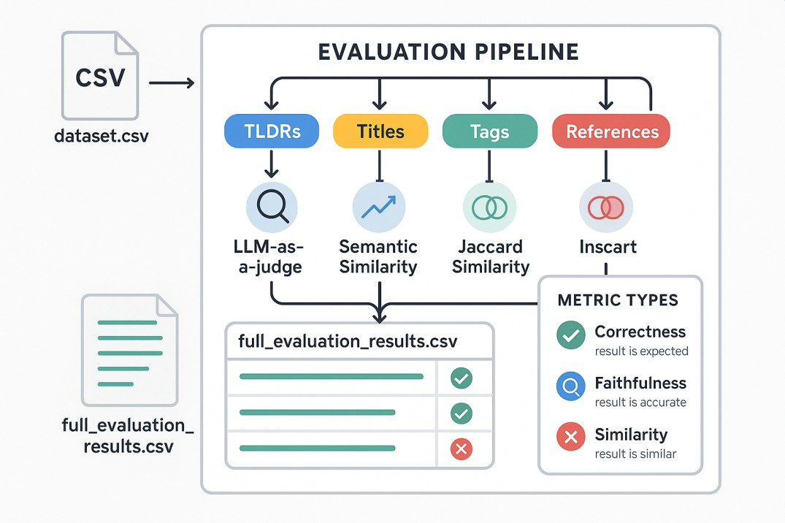

## 1. Overall Evaluation

**Context:**  
The overall evaluation provides a quality assessment of your generated dataset by applying multiple evaluation strategies to every record. This approach ensures that all key aspects—summarization, titling, tagging, and referencing—are measured both with classical metrics and LLM-based judgment. The goal is to give a holistic view of how well the machine-generated content matches the human reference data.

**What is measured:**  
- **TLDRs:** Are they accurate, similar in meaning, and faithful to the reference?
- **Titles:** Do they capture the intent and factual content of the original?
- **Tags:** Do the sets of tags overlap?
- **References:** Are the cited works similar in both lists?

**How it works:**  
- For each record, the script runs LLM-as-a-judge (using GEval) on TLDRs and titles, computes semantic similarity and faithfulness, and calculates Jaccard similarity for tags and references.
- All results are combined into a single output CSV for easy comparison and analysis.

**Output:**  
- `full_evaluation_results.csv`  
  Contains all original columns plus scores, pass/fail flags, and LLM explanations for each metric and field.

**Interpretation:**  
A high score and a pass flag indicate strong agreement with the reference, while lower scores or failed flags highlight areas for model improvement.

## 2. TLDR Evaluation

**Context:**  
The TLDR (Too Long; Didn’t Read) field is often the most concise summary of a publication. Evaluating its quality is crucial for ensuring users can quickly understand the core message.

**What is measured:**  
- **LLM-as-a-Judge (Correctness):** Does the generated TLDR accurately and concisely summarize the main points of the publication, as expressed in the reference TLDR?
- **Similarity (GEval):** Does the generated TLDR convey the same meaning as the reference, even if worded differently?
- **Faithfulness (GEval):** Is the generated TLDR factually consistent, or does it introduce inaccuracies or hallucinations?

**How it works:**  
- The script uses DeepEval’s GEval metric with different criteria for correctness, similarity, and faithfulness.
- For each TLDR pair (generated vs. reference), the LLM provides a score (0 to 1), a pass/fail flag, and a natural language explanation.

**Output:**  
Each row in the output CSV includes:
- `tldr_judge_score`, `tldr_judge_passed`, `tldr_judge_reason`
- `tldr_similarity_score`, `tldr_similarity_passed`, `tldr_similarity_reason`
- `tldr_faithfulness_score`, `tldr_faithfulness_passed`, `tldr_faithfulness_reason`

**Interpretation:**  
- **High scores and pass flags** mean the TLDR is accurate, semantically similar, and faithful.
- **Low scores or fail flags** indicate issues like missing key points, factual errors, or hallucinations.

## 3. Title Evaluation

**Context:**  
A publication’s title is its first impression. A good generated title should be as informative and accurate as the human-written reference.

**What is measured:**  
- **LLM-as-a-Judge (Correctness):** Does the generated title accurately and concisely represent the main idea as in the reference?
- **Similarity (GEval):** Does the generated title capture the same intent and meaning?
- **Faithfulness (GEval):** Is the generated title factually consistent, or does it introduce errors or misleading information?

**How it works:**  
- The script applies the same LLM-based and semantic metrics as for TLDRs, but to the title fields.
- If the generated title is a list, the first element is used.

**Output:**  
Each row in the output CSV includes:
- `title_judge_score`, `title_judge_passed`, `title_judge_reason`
- `title_similarity_score`, `title_similarity_passed`, `title_similarity_reason`
- `title_faithfulness_score`, `title_faithfulness_passed`, `title_faithfulness_reason`

**Interpretation:**  
- **High scores and pass flags** mean the generated title is a good substitute for the reference.
- **Low scores or fail flags** indicate the title is misleading, incomplete, or factually incorrect.

## 4. Reference Evaluation

**Context:**  
References are critical for scholarly work. Evaluating them ensures that the generated references are as comprehensive and relevant as the human-curated ones.

**What is measured:**  
- **Jaccard Similarity:** Compares the set of reference titles in the generated and reference lists to measure overlap.

**How it works:**  
- The script extracts all titles from both the generated and reference lists (handling both Python object and Markdown formats).
- The Jaccard similarity is calculated as the size of the intersection divided by the size of the union of the two sets.

**Output:**  
Each row in the output CSV includes:
- `references_jaccard_similarity` (0 = no overlap, 1 = perfect match)

**Interpretation:**  
- **Score near 1:** Most or all references match.
- **Score near 0:** Very little or no overlap.

## 5. LLM Judge Evaluation

**Context:**  
LLM-as-a-judge is a modern evaluation paradigm where a large language model is prompted to act as a human reviewer, providing nuanced, context-aware scoring and explanations.

**What is measured:**  
- **LLM-as-a-Judge (GEval):** The LLM evaluates the generated field (TLDR or title) against the reference and provides:
  - A score (typically 0–1)
  - A pass/fail flag (based on a threshold)
  - A natural language explanation

**How it works:**  
- For each record, the LLM is shown both the generated and reference field, along with a specific evaluation criterion.
- The LLM’s output is parsed into a score, pass/fail, and reason.

**Output:**  
Each row in the output CSV includes (for both TLDRs and titles):
- `tldr_judge_score`, `tldr_judge_passed`, `tldr_judge_reason`
- `title_judge_score`, `title_judge_passed`, `title_judge_reason`

**Interpretation:**  
- **High score and pass:** The LLM finds the output accurate and appropriate.
- **Low score or fail:** The LLM flags issues and provides a reason for the failure.

**How to Use These Evaluations:**

1. **Run the provided scripts** on your dataset with your OpenAI API key.
2. **Review the output CSV** (e.g., `full_evaluation_results.csv`) for detailed, field-by-field and metric-by-metric feedback.
3. **Analyze scores and explanations** to identify strengths and weaknesses in your model’s outputs.
4. **Iterate and improve** your generation models based on these insights.