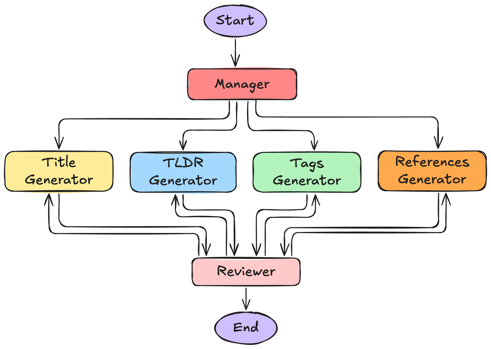

--DIVIDER--

# TL;DR

This lesson walks through a practical case study for evaluating a multi-agent AI system using golden datasets, automated metrics, and custom evaluation methods. You'll learn how to assess both component-level quality and system-wide coordination, and build an evaluation pipeline that reveals how well your agents work together — not just individually.

---

--DIVIDER--

## Introduction

You’ve built your multi-agent system. The pieces are in place, the outputs look reasonable — but how do you _actually_ know it’s working well?

If you’re wondering how to evaluate the performance and coordination of your system, this lesson will walk you through a practical, end-to-end case study.

Earlier in the module, we discussed how agentic system evaluation goes beyond traditional testing ([see lesson](https://app.readytensor.ai/publications/FO7hdfmkhl42)). We explored seven evaluation methods ([see lesson](https://app.readytensor.ai/publications/ljPGqR17HJmj)), learned how to choose metrics that fit your use case ([see lesson](https://app.readytensor.ai/publications/68dY0FXJ1gI1)), and got hands-on with tools like [RAGAS](https://app.readytensor.ai/publications/Frw6T1fBzVTF) and [DeepEval](https://app.readytensor.ai/publications/6QRSBm5gdx2J).

Now it’s time to bring it all together.

:::info{title="Info"}

 <h3>Joining Midway?</h3>
 If you're jumping in here without following the earlier lessons in this series, no problem — this one stands on its own.
 :::
 
 
 
 In this lesson, we’ll evaluate a real-world multi-agent authoring system using RAGAS and custom metrics — applying everything we’ve covered so far in a focused, implementation-driven walkthrough.
 
---

--DIVIDER--

# The System We’re Evaluating

For this case study, we’ll evaluate the **Agentic Authoring Assistant (A3)** — a multi-agent system that helps generate metadata for AI/ML publications. The A3 takes as input a user's publication write-up, typically the article body, abstract, or project description. Based on this source content, it produces the **title**, **tags**, **TL;DR**, and **references** to improve how projects are presented, discovered, and shared.

A3 uses a coordinated multi-agent setup based on the _Supervisor_ pattern, where agents generate outputs in parallel from shared context. The system architecture is as follows:

--DIVIDER--

 
 Architecture of the Agentic Authoring Assistant (A3)

--DIVIDER--

If you want to dive deeper into how it was built, check out [this lesson from Week 6](https://app.readytensor.ai/publications/redklSjefHNo).

Now, let’s look at how we can systematically evaluate its outputs.

---

--DIVIDER--

# Designing the Evaluation Plan

We weren’t just trying to evaluate individual outputs. We wanted to know whether the entire system, running in parallel with shared context, could deliver cohesive, high-quality results.

Consider this sample output:

- **Title**: _“Advanced Optimization Techniques for Large-Scale Neural Networks”_
- **Tags**: `["deep learning", "optimization", "neural networks", "performance"]`
- **TL;DR**: _“This paper presents novel approaches to optimizing neural network training at scale, focusing on memory efficiency and convergence speed.”_
- **References**: _(Mix of sources on optimization, distributed training, and gradient compression)_

Looks fine at a glance. But the real question is — does it **work together**?

That led us to five guiding questions:

> 1.  **Is each part useful on its own?**
> 2.  **Do they align conceptually?**
> 3.  **Are they grounded in the source?**
> 4.  **Do they cover the key ideas?**
> 5.  **Does the whole thing feel cohesive?**

---

--DIVIDER--

## What Good Outputs Look Like

To answer those questions, we needed a benchmark.

Luckily, we didn’t have to invent one.

Our platform already hosts well-written publications — with strong titles, summaries, tags, and references. We pulled a curated sample from these and built a **golden dataset**: a small, high-quality reference set to evaluate against.

With that, we could now match **each output type** to the **kind of measurement** that made sense.

--DIVIDER--

:::info{title="Info"}

 <h2>No Ground Truth? Your Options</h2>
 
 In our case, we had high-quality examples readily available — but that won’t always be true.
 
 If we didn’t, we’d have two options:
 - Build one ourselves using SMEs across different AI/ML domains — time-consuming (and costly), but accurate.
 - Skip ground truth and rely fully on the LLM-as-a-Judge method — faster, but more subjective.
 
 Both are valid depending on your constraints. The key is choosing what’s feasible and defensible for your use case.
 :::
 
 ---

--DIVIDER--

## Matching Metrics to What Matters

We avoided one-size-fits-all metrics. Instead, we asked: _what matters most for this kind of output?_

- For **titles** and **TL;DRs**, we care about accuracy and meaning → so we used **semantic similarity** and **faithfulness** via **RAGAS**.
- For **tags** and **references**, it’s about coverage and overlap → so we used **Jaccard similarity**.
- For **coherence across components**, we used an **LLM-as-a-Judge** approach to assess alignment.

So, we ended up with a mix of methods:

- Semantic similarity checks for conceptual alignment (even with different phrasing).
- Faithfulness flags hallucinations.
- Jaccard gives us signal on overlap for list-style outputs.
- LLM-as-a-Judge fills the gap when judgment is subjective or fuzzy.

We weren’t looking for a final grade. We were looking for _patterns we could learn from_.

> _Curious how each of these metrics works? See the **Appendix: Understanding the Evaluation Metrics** for a deeper explanation._

--DIVIDER--

:::tip{title="Tip"}

 <h2>Mixed Metrics Are the Norm</h2>
 Notice how we combine three types of metrics:
 
 * Built-in tools from **RAGAS** (semantic similarity, faithfulness)
 * A classic **ML metric** like **Jaccard similarity**
 * A **custom LLM-based rating** for subjective aspects like coherence
 
 This mix reflects how most real-world evaluation works: you adapt metrics to fit your needs. Don’t just rely on what a library gives you — extend it where it matters.
 :::
 
---

--DIVIDER--

## Evaluation Metrics Summary Table

The following table summarizes the components we will evaluate, what we measure, how we measure it, and the specific metrics used:

| Component  | Evaluation Focus              | Method               | Metrics                           |
| ---------- | ----------------------------- | -------------------- | --------------------------------- |
| Title      | Relevance, clarity, grounding | RAGAS                | Semantic similarity, faithfulness |
| Tags       | Topic coverage                | Rule-based + dataset | Jaccard similarity                |
| TL;DR      | Brevity, clarity, grounding   | RAGAS                | Semantic similarity, faithfulness |
| References | Relevance, citation validity  | Rule-based           | Jaccard similarity                |
| Coherence  | Consistency across components | LLM-as-a-Judge       | Coherence score                   |

> Not perfect. But grounded, adaptable, and easy to iterate on.

---

--DIVIDER--

# Implementing the Evaluation Pipeline

Now that we had our plan, it was time to implement the evaluation pipeline.

--DIVIDER--

## 🛠️ Building the Golden Dataset

The foundation of our evaluation is a **golden dataset** — a carefully curated collection of publication content with expert-annotated ground truth values.

Each sample in our dataset contains:

**Original Content**:

- `publication_id`: Unique identifier
- `publication_description`: The original publication text

**Generated Outputs** (from A3):

- `title_generated`: A3's generated title
- `tags_generated`: A3's generated tags
- `tldr_generated`: A3's generated TL;DR
- `references_generated`: A3's generated references

**Ground Truth** (expert annotations from the publication itself):

- `title_truth`: The ideal title
- `tags_truth`: The ideal tag set
- `tldr_truth`: The ideal TL;DR
- `references_truth`: The ideal references

This structure lets us compare A3's outputs directly against expert expectations for the same content.

--DIVIDER--

---

 <h2> 📦 Code and Walkthrough </h2>
 
 Want to try this yourself?
 
 - The full implementation is available in the [code repository](https://github.com/readytensor/rt-agentic-ai-cert-week7).
 - A step-by-step walkthrough video will be embedded below:
 
 
 <!-- TODO: Replace VIDEO_ID_HERE with actual YouTube ID -->
 
 ---

--DIVIDER--

## 📊 Running the Complete Evaluation

With our golden dataset and metrics defined, the evaluation process becomes a straightforward pipeline:

**Step 1: Load the Golden Dataset**  
 Import your dataset containing publication content, A3 outputs, and ground truth annotations.

**Step 2: Apply Metrics by Component Type**

- **Titles**: Semantic similarity + faithfulness against source content
- **TL;DRs**: Semantic similarity + faithfulness against source content
- **Tags**: Jaccard similarity between generated and truth tag sets
- **References**: Jaccard similarity between generated and truth reference sets

**Step 3: Aggregate and Analyze**  
 Collect scores across all publications to understand system-wide performance patterns.

## Sample Evaluation Results

Here's what typical results look like:

| Publication | Title Semantic | Title Faithfulness | Tags Jaccard | References Jaccard |
| ----------- | -------------- | ------------------ | ------------ | ------------------ |
| pub_001     | 0.89           | 0.92               | 0.75         | 0.60               |
| pub_002     | 0.76           | 0.88               | 0.67         | 0.80               |
| pub_003     | 0.94           | 0.85               | 0.83         | 0.45               |

**What this tells us**:

- **pub_001**: Strong title performance, good tag overlap, weaker reference matching
- **pub_002**: Moderate title quality, decent overall performance
- **pub_003**: Excellent title and tags, but struggled with references

---

--DIVIDER--

# Improving A3 Based on Evaluation Scores

The evaluation numbers aren’t just for reporting — they’re for learning and improving your system.

Once we saw where A3 performed well and where it struggled, we could translate those patterns into specific fixes. Instead of guessing what to improve, we had data-backed clues pointing to exactly where to look.

Let’s decode a few examples:

- **Low faithfulness + high similarity?**
  A3 sounds smart but is inventing details.
  → Tighten grounding prompts, add explicit source-checking.
  _e.g., Title says “neural networks” but the paper only covers linear models._

- **Low Jaccard for tags or references?**
  The extraction logic is off — maybe too generic or inconsistent.
  → Refine prompt phrasing, add examples that match your tagging or citation philosophy.
  _e.g., Tags say “AI” when your golden set expected “contrastive learning.”_

- **High variance across publication types?**
  The same prompts won’t work for every kind of publication.
  → This is trickier to solve. You may need to extend the Manager agent’s role to include content-type detection and apply type-specific instructions or routing.
  _Blog posts ≠ academic papers._

- **One component always lags?**
  That’s likely your weakest agent — the one that needs the most attention.
  → Revisit how you structure prompts, context, or agent responsibilities for that component and consider whether your Reviewer agent’s instructions are providing enough signal to catch and correct issues.
  _Sometimes, the fix isn’t in generation — it’s in improving your review layer._

- **Low overall coherence**
  Revisit prompting for the Manager agent — a tighter memo or better coordination instructions can lead to stronger system-wide alignment.
  → Revisit prompting for the Manager agent.
  _Sometimes coherence problems aren’t about the agents themselves — they’re about how well the supervisor sets the stage._

---

--DIVIDER--

# What’s Next: Scaling A3 and Its Evaluation

We’re now in the process of embedding this metadata sub-system into a broader agentic workflow — one that supports the **full authoring lifecycle** for AI/ML publications.

That means:

- Generating not just metadata, but full sections of a write-up
- Evaluating not just individual outputs, but long-form structure, coherence, and flow
- Scaling the evaluation pipeline to handle **larger, more complex tasks** with even more subjective dimensions

The techniques we covered here — choosing metrics that match your output, combining automated scores with judgment-based methods, and interpreting patterns rather than chasing perfect scores — will apply even more as the system grows.

By now, you should have a clear blueprint for how to:

- Design evaluations that fit your agentic system
- Use mixed metrics to capture quality across different output types
- Turn evaluation data into **targeted improvements** that actually move the needle

This isn’t the end — just a checkpoint. The more advanced your agents become, the more nuanced your evaluation must be.

The more you build, the more you’ll need to evaluate. And the better you evaluate, the faster you’ll build systems that truly work.

---

--DIVIDER--

# Appendix: Understanding the Evaluation Metrics

Our evaluation uses different metrics tailored to different output types. Let's understand what each one measures and why it matters.

## Semantic Similarity for Titles and TL;DRs

When evaluating text-based outputs, we need a metric that understands meaning rather than just matching words. Semantic similarity solves this by measuring how conceptually close generated text is to our ground truth, even when the exact phrasing differs dramatically. A title like "Machine Learning Optimization Techniques" and "Optimizing ML Models" share the same core concepts despite using completely different vocabulary.

The magic happens through embedding models that convert text into high-dimensional vector representations. RAGAS transforms both the generated and truth text into these semantic vectors, then calculates their similarity in this meaning-rich space. A score of 0.95 might compare "Deep Learning for NLP" with "Neural Networks in Natural Language Processing" — different words, same concept. Meanwhile, "Machine Learning Trends" vs "Database Optimization Methods" might score only 0.3, reflecting their conceptual distance despite both being technical topics.

## Faithfulness for Titles and TL;DRs

Semantic similarity tells you whether A3 understands the concepts, but faithfulness tells you whether it's staying honest about what the source material actually contains. This distinction matters enormously. A generated title might be semantically similar to your ground truth while still being fundamentally unfaithful if it emphasizes aspects barely mentioned in the publication or introduces claims not supported by the content.

RAGAS evaluates faithfulness by using an LLM to analyze whether the generated text is genuinely supported by the source material. It checks for the subtle hallucinations and misrepresentations that plague many AI systems. High faithfulness means the title captures what the paper actually focuses on; low faithfulness suggests A3 is making unsupported leaps or emphasizing minor details as if they were central themes.

## Jaccard Similarity for Tags and References

When dealing with lists like tags and references, we need a fundamentally different approach. Here, we care about set membership — which items are included — rather than the semantic nuances that matter for text. Jaccard similarity measures exactly this: the overlap between two sets, calculated as the size of their intersection divided by the size of their union.

This metric perfectly captures what matters for list-based outputs. Consider A3 generating tags `["machine learning", "optimization", "neural networks"]` while our ground truth contains `["optimization", "neural networks", "deep learning"]`. The intersection contains two items (`["optimization", "neural networks"]`), while the union contains four unique items. The resulting Jaccard score of 0.5 precisely quantifies that A3 captured half of what it should have while adding some items that weren't in the truth set.

---
